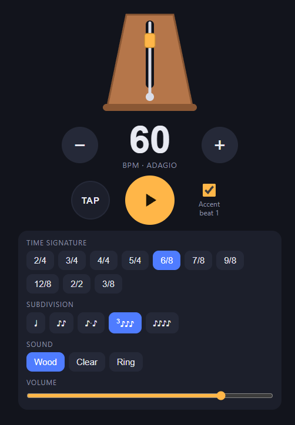

# I Didn't Have to Live Like That

I was chatting with friends on Discord and mentioned that the metronome app on my phone shows me a full screen ad. A full screen ad, with a little bar at the top that you are permitted to tap after five to ten seconds, at which point you may return to your guitar practice. Both friends groaned with audible pity. They told me I should just generate myself a metronome app instead of suffering, and I sat there and realized they're right. I don't have to live like that.

I told my wife later and she was also horrified. It didn't seem that bad to me!

## The metronome

So now I have [my own metronome](https://kellyhuntlin.com/metronome/). Time signatures, subdivisions, tap tempo, toggleable accent... It's a web app that installs as a PWA. Open it in Safari on iPhone, hit Share, then Add to Home Screen, and it behaves like a native app from then on. It works offline and no ads, obviously. Someone suggested putting it on the App Store but my heart is not ready to pay Apple money for that Developer Program. Must be nice to be Android users that don't have to pay Apple to put stuff up on their App Store.

<figure>
<a href="https://kellyhuntlin.com/metronome/" class="showcase-img-link">

</a>
<figcaption>The app at 60 BPM in 6/8.</figcaption>
</figure>

It has a little animation of a metronome. Like many, I have a fondness for analog and physical things. I'd like to own a real wooden metronome, but I can't justify buying one when the electronic kind works fine and fits in a pocket.

## Why it took me this long

I had been tapping that little bar for at least a year. 

I think it's because I'm weirdly tolerant of friction, and I think I know where that came from. Before software, I worked in pharma as a chemist, and the physical world throws friction at you all the time. HPLC plumbing leaks. Columns degrade. The robotic pipette occasionally pulls up air instead of liquid and you don't find out until your results are garbage. Even other people can pipette poorly and there is nothing you can do about other people. pH meter sucks that day, did the lab humidity change? Now I'm in a field where a lot of friction is more optional. 

I've watched coworkers who don't tolerate friction, and they end up writing more tools and improving more workflows because they hate the papercuts. Sometimes that turns into spending more time on the tooling than the goal, like the productivity-app phenomenon where people optimize their note-taking system forever and never take notes about the thing they were trying to do. Or the one about people blogging spending all their time tweaking their blog setup. But in the median case, I think the intolerant ones are right, and if I hated friction more I would fix more things and be a better engineer for it.

The tolerance isn't completely worthless, at least. It's a grinding capability, and patient grinding is most of what practice is. It's what lets me partly enjoy sitting with the same Julio Sagreras exercise until my fingers get it. But there's a difference between grinding at a skill and grinding through an ad. The old XKCD chart about when automation pays off has an axis for how long the fix takes, and that axis has really changed. Generating a metronome app costs less than an evening now. Kinda cool, kinda spooky. 

